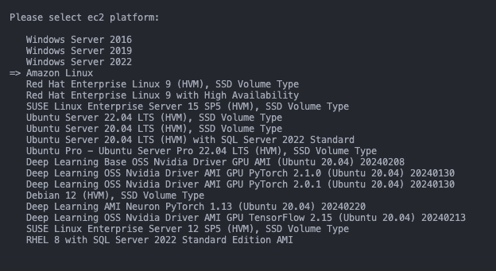
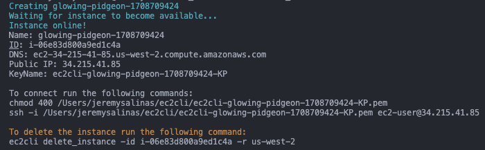

# ec2cli

## A simple CLI tool to create disposable ec2's in AWS

This tool requires access to boto3 credentials that can be configured by setting environment variables or using "aws configure" from the aws cli.

More information on boto3 credentials [here](https://boto3.amazonaws.com/v1/documentation/api/latest/guide/credentials.html).

#### Get started:
- Create project directory.
 
  ```
  mkdir CSE_CLI
  ```
- Create Virtual Environment
  ```
  python -m venv .venv
  ```
- Activate venv
  - Windows
  ```powershell
     .\.venv\Scripts\Activate.ps1
  ```
  - Mac/Linux
  ```zsh
    source .venv/bin/activate
  ```
- Install dependencies
  ```zsh
  pip install --editable .
  ```
- Confirm ec2cli is accessible
  ```
  ec2cli --help
  Usage: ec2cli [OPTIONS] COMMAND [ARGS]...

  Options:
    --help  Show this message and exit.

  Commands:
    create_instance
    delete_instances
    get_instances
    get_password
    start_instance
  ```
- By default create_instance will create an instance in your default region based on your profile settings in the region's default VPC and create an instance name, security group, keypair, and inbound rules from your public IP (RDP for Windows and SSH otherwise).
```
ec2cli create_instance
```
  
- All of the info needed to connect will be provided after instance creation.


- Instances created with this tool will be terminated on shutdown by default.
- It is still a good idea to clean up after yourself by running:
  
```zsh
ec2cli delete_instance -id INSTANCE_ID -r REGION
```
- This will delete the instance and attempt to delete the attached security group provided it isn't still in use by other resources.

## 🤝 Contributing
